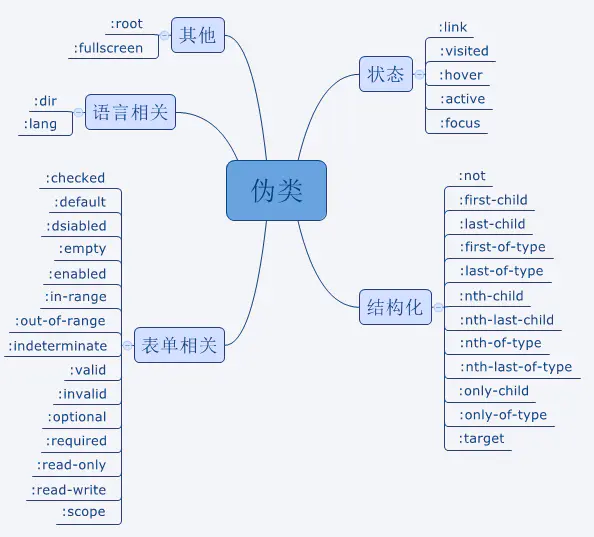
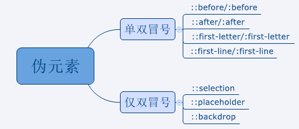
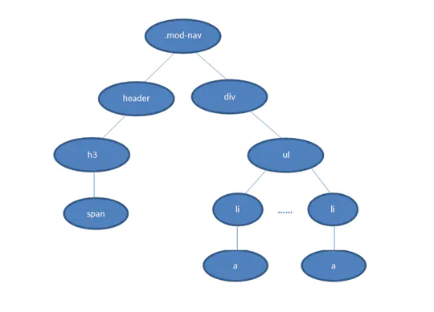

## CSS Hack

> CSS hack 是通过在css样式中加入一些特殊的符号，让不同的浏览器识别不同的符号（什么样的浏览器识别什么样的符号是有标准的，css hack就是让你记住这个标准），以达到应用不同css样式的目的

### 常见的几种形式：

- 属性级Hack：比如IE6能识别下划线“`_`”和星号“`*`”，IE7能识别星号“`*`”，但不能识别下划线”`_` ”，而firefox两个都不能认识。
- 选择符级Hack：比如IE6能识别`*html .class{}`，IE7能识别`*+html .class{}`或者`*:first-child+html .class{}`。
- IE条件注释Hack：IE条件注释是微软IE5开始就提供的一种非标准逻辑语句。比如针对所有IE：`<!-[if IE]><!-您的代码-><![endif]>`，针对IE6及以下版本：`<!-[if it IE 7]><!-您的代码-><![endif]->`，这类Hack不仅对CSS生效，对写在判断语句里面的所有代码都会生效。

> 不推荐使用css hack处理浏览器之间的兼容性问题：
> hack虽然对页面表现的一致性有好处，但过多的滥用会造成html文档混乱不堪，增加管理和维护的负担。而且浏览器更新之后可能会产生更多的兼容性问题

### 常见的几个css hack：

- 图片间隙
  - 在div中插入图片，图片会将div下方撑大3px。
    - hack1：将div与img写在同一行。
    - hack2：给img添加display：block；
  - dt li 中的图片间隙
    - hack1：给img添加display：block
- 默认高度
  - IE6以下版本中，部分块元素，拥有默认高度（低于18px）
    - hack1：给元素添加：font-size：0；
    - hack2：声明：overflow：hidden；
  - 表单行高不一致
    - hack1：给表单添加声明：float：left；height： ；border： 0；
  - 鼠标指针
    - hack1：若统一某一元素鼠标指针为手型：cursor：pointer；
  - 当li内的a转化块元素时，给a设置float，IE里面会出现阶梯状
    - hack1：给a加display：inline-block；
    - hack2：给li加float：left；

## 清除浮动的几种方式

### clear:both

> 在浮动元素元素后方新增一个空标签或者在第二个div上，设置样式clear：both，可清除浮动。
>
> 缺点：结构化差，添加无意义了标签

```html
<!DOCTYPE html>
<html lang="en">
<head>
    <meta charset="UTF-8">
    <meta name="viewport" content="width=device-width, initial-scale=1.0">
    <title>Document</title>
    <style> 
       .content{
           width: 800px;
           background-color: bisque;
       }
       .div1,.div2{
           width: 200px;
           height: 200px;
           background-color: black;
       }
       .div1{
           float: left;
       }
       .clear{
           clear: both;
       }
    </style>
</head>
<body>
    <div class="content">
          <div class="div1"></div>
          <div class="clear"></div>
          <div class="div2"></div>
    </div>
</body>
</html>
```

###  **父级添加overflow方法**

> 在父级元素添加样式overflow可以清楚浮动（可以包裹住浮动元素），主要是撑起父元素的高度。
>
> 缺点：子元素需要显示的内容可能被隐藏，不能和position配合使用

```html
<!DOCTYPE html>
<html lang="en">
<head>
    <meta charset="UTF-8">
    <meta name="viewport" content="width=device-width, initial-scale=1.0">
    <title>Document</title>
    <style> 
       .content{
           width: 800px;
           background-color: bisque;
           overflow: hidden;
       }
       .div1{
           width: 200px;
           height: 300px;
           background-color: black;
       }
       .div1{
           float: left;
       }
    </style>
</head>
<body>
    <div class="content">
          <div class="div1"></div>
          <div class="div2"></div>
    </div>
</body>
</html>
```

### 使用after伪元素清除浮动

> 符合闭合浮动思想，结构语义化正确；ie6,ie7使用zoom：1，触发hasLayout，主要也是撑起父元素高度。

```html
<!DOCTYPE html>
<html lang="en">

<head>
    <meta charset="UTF-8">
    <meta name="viewport" content="width=device-width, initial-scale=1.0">
    <title>Document</title>
    <style>
        .content {
            width: 800px;
            background-color: bisque;
            zoom: 1;
        }
        .content:after{
            content: "";
            display: block;
            height: 0;
            clear: both;
            /* 元素不可见 */
            visibility: hidden;  
        }
        .div1 {
            width: 200px;
            height: 300px;
            background-color: black;
        }

        .div2 {
            width: 300px;
            height: 200px;
            background-color: rgb(75, 73, 73);
        }
        .div1 {
            float: left;
        }
    </style>
</head>

<body>
    <div class="content">
        <div class="div1"></div>
        <div class="div2"></div>
    </div>
</body>

</html>
```

### 使用双伪元素

> 使用before和after双伪元素清除浮动

```html
<!DOCTYPE html>
<html lang="en">

<head>
    <meta charset="UTF-8">
    <meta name="viewport" content="width=device-width, initial-scale=1.0">
    <title>Document</title>
    <style>
        .content {
            width: 800px;
            background-color: bisque;
            zoom: 1;
        }
        .content:after,.content:before{
            content: "";
            display: table;
        }
        .content:after{
            clear: both;
        }
        
        .div1 {
            width: 200px;
            height: 300px;
            background-color: black;
        }

        .div2 {
            width: 300px;
            height: 200px;
            background-color: rgb(75, 73, 73);
        }
        .div1 {
            float: left;
        }
    </style>
</head>

<body>
    <div class="content">
        <div class="div1"></div>
        <div class="div2"></div>
    </div>
</body>

</html>
```

## CSS3新特性

- CSS3实现圆角（border-radius）
- 阴影（box-shadow）
- 文字特效（text-shadow）
- 线性渐变（gradient）
- 转换（transform）
- 加载字体（@font-face）
- 过渡（transition）
- 动画（animation）
- 多列布局（multi-column layout）
- flex布局
- CSS3选择器
  - E:last-child 匹配父元素的最后一个子元素E
  - E:nth-child()匹配父元素的第n个子元素E
  - E:nth-last-child(n)匹配父元素的倒数第n个子元素E

## link与@import的区别

- link的html方式，@import是css方式
- link最大限度支持并行下载，@import过多嵌套导致串行下载，出现fouc（文档样式短暂失效）
- 浏览器对link的支持早于@import，可以使用@import对老浏览器隐藏样式
- @import必须在样式规则之前，可以在css出生中引用其他文件
- 总体来说：link优于@import

## 伪类和伪元素

> css引入伪类和伪元素概念是为了格式化文档树以外的信息，伪类和伪元素是用来修饰不在文档树中的部分。

### 伪类

用于当元素处于某个状态时，为其添加对应的样式，这个状态是根据用户行为而动态变化的。比如说，用户悬停在指定的元素时，我们可以通:hover来描述这个元素的状态。虽然它和普通的css类类似，可以为已有的元素添加样式，但是它只有处于dom树无法描述的状态下才能为元素添加样式，所以将其称为伪类。



### **伪元素** 

用于创建不在文档树中的元素，并为其添加样式，比如说，我们可以通过：before来在一个元素前添加一些文本，并为这些文本添加样式。虽然用户可以看到这些文本，但是这些文本实际上不在文档树中。



## 实现div固定宽高比(4:3)

利用css中 `padding`百分比的计算方法： `padding`设置为百分比，是以元素的宽度乘以`100%`从而得到的`padding`值的。在`div`的`width`为固定的情况下，设置`height`为`0`，使内容自然溢出，再通过设置`padding-bottom`使元素有一定高度。

```css
.element {
    /* 16:9宽高比，则设padding-bottom:56.25% */
    /* height: 0px, 防止矩形被里面的内容撑出多余的高度*/
    width: 100vw; 
    height: 0px; 
    padding-bottom: 56.25%;
    background: pink;
}
```

> 利用将`padding-top`或`padding-bottom`设置成百分比，来实现高度满足宽度的某个比例。因为，当`margin/padding`取形式为百分比的值时，无论是`left/right`，还是`top/bottom`，都是以父元素的`width`为参照物的！

## css解析规则

> css选择器是从右向左解析




> 若从左向右的匹配，过程是：从`.mod-nav`开始，遍历子节点`header`和子节点`div`，然后各自向子节点遍历。在右侧`div`的分支中，最后遍历到叶子节点`a`，发现不符合规则，需要回溯到`ul`节点，再遍历下一个`li-a`，假如有1000个`li`，则这`1000`次的遍历与回溯会损失很多性能。
>
> 从右至左的匹配：先找到所有的最右节点span，对于每一个`span`，向上寻找节点`h3`，由`h3`再向上寻找`class=mod-nav`的节点，最后找到根元素html则结束这个分支的遍历。
>
> 很明显，两种匹配规则的性能差别很大。之所以会差别很大，是因为从右向左的匹配在第一步就筛选掉了大量的不符合条件的最右节点（叶子节点）；而从左向右的匹配规则的性能都浪费在了失败的查找上面。

## display: none和 visibility:hidden

是否占据空间

- display: none 不占据空间
- visibility:hidden 占据空间

是否渲染

- display:none，会触发reflow（回流），进行渲染。
- visibility:hidden，只会触发repaint（重绘），因为没有发现位置变化，不进行渲染。

是否是继承属性(株连性)

- display:none，display不是继承属性，元素及其子元素都会消失。
- visibility:hidden，visibility是继承属性，若子元素使用了visibility:visible，则不继承，这个子孙元素又会显现出来。

## 实现两栏布局

### 使用浮动—float

```css
.wrap {
    overflow: hidden;
    border: 1px solid red;
}
/* 脱离文档流 */
.left {
    float: left;
    width: 200px;
    height: 200px;
    background: purple;
}

.right {
    margin-left: 200px;
    background: skyblue;
    height: 200px;
}
```

### 使用绝对定位实现—absolute

```css
.wrap {
    overflow: hidden;
    position: relative;
}
/* 脱离文档流 */
.left {
    position: absolute;
    left: 0;
    top: 0;
    width: 200px;
    height: 200px;
    background: purple;
}

.right {
    margin-left: 200px;
    background: skyblue;
    height: 200px;
}
```

### 使用表格布局—table

```css
.wrap {
    display: table;
    width: 100%;
}

.left {
    display: table-cell;
    width: 200px;
    height: 200px;
    background: purple;
}

.right {
    display: table-cell;
    background: skyblue;
    height: 200px;
}
```

### 使用calc()函数

```css
.wrap {
    overflow: hidden;
}

.left {
    float: left;
    width: 200px;
    height: 200px;
    background: purple;
}

.right {
    float: left;css
    background: skyblue;
    height: 200px;
    width: calc(100% - 200px);
}
```

### 使用弹性布局—flex

```css
.wrap {
    display: flex;
}
.left {
    height: 200px;
    background: purple;
    width: 200px;
}
.right {
    background: skyblue;
    height: 200px;
    flex: 1;
}
```

## 实现三列布局

### position实现

> position实现: 左右边设置绝对定位,设置一个最外级div (给父元素设置relative,相对于最外层定位)注意绝对定位的元素脱离文档流,相对于最近的已经定位的元素进行定位, 无需考虑HTML中结构的顺序。
> 缺点：有顶部对齐问题，需要进行调整，注意中间的高度为整个内容的高度。

### float实现 

> float实现:需要将中间的内容放在html结构的最后,否则右侧会沉在中间内容的下侧。
> 原理: 元素浮动后,脱离文档流,后面的元素受浮动影响,设置受影响元素的margin值即可

### flex布局

> 设置中间元素flex：1

### 杯布局和双飞翼布局

> 共同点：三栏全部float浮动，但左右两栏加上负margin让其跟中间栏div并排，以形成三栏布局。[负边距](http://www.cnblogs.com/2050/archive/2012/08/13/2636467.html)是这两种布局中的重中之重。                         不同点：解决“中间栏div内容不被遮挡”的思路不同

#### 杯布局

```html
<!DOCTYPE html>
<html lang="en">
<head>
    <meta charset="UTF-8">
    <meta name="viewport" content="width=device-width, initial-scale=1.0">
    <meta http-equiv="X-UA-Compatible" content="ie=edge">
    <title>Document</title>
    <style>
        .content {
			overflow: hidden;
			padding: 0 100px;
		}
        .middle {
            width: 100%;
            height: 100px;
            background: red;
            float:left;
            position:relative;	
        }
        .left {
            width: 100px;
            height: 100px;
            background: green;
            float:left;
            margin-left: -100%;
            position: relative;
            left: -100px;
        }
        .right {
            width: 100px;
            height: 100px;
            background: blue;
            float:left;
            margin-left: -100px;
            position: relative;
            right: -100px;
        }
    </style>
</head>
<body>
    <div class="content">
        <div class="middle">
            middle
        </div>
        <div class="left"></div>
        <div class="right"></div>
    </div>
</body>

</html>
```

#### 双飞翼布局

```html
<!DOCTYPE html>
<html lang="en">
<head>
    <meta charset="UTF-8">
    <meta name="viewport" content="width=device-width, initial-scale=1.0">
    <meta http-equiv="X-UA-Compatible" content="ie=edge">
    <title>Document</title>
    <style>
        .content {
			overflow: hidden;
		}
        .middle {
            width: 100%;
            float:left;
        }
        .middle-content {
            width: 100%;
            height: 100px;
            background: red;
            margin-left: 100px;
            margin-right: 100px;
        }
        .left {
            width: 100px;
            height: 100px;
            background: green;
            float:left;
            margin-left: -100%;
        }
        .right {
            width: 100px;
            height: 100px;
            background: blue;
            float:left;
            margin-left: -100px;
        }
    </style>
</head>
<body>
    <div class="content">
        <div class="middle">
            <div class="middle-content">
                    middle
            </div>
        </div>
        <div class="left"></div>
        <div class="right"></div>
    </div>
</body>

</html>
```

> [常见的css布局的实现](https://github.com/funnycoderstar/blog/issues/125)

## vertical-align

> **`vertical-align`** 用来指定行内元素（inline）或表格单元格（table-cell）元素的垂直对齐方式。详情：[MDN](https://developer.mozilla.org/zh-CN/docs/Web/CSS/vertical-align)

## CSS画三角形

```css
width: 0;
height: 0;
border-top: 40px solid transparent;/* 方向向下*/
border-left: 40px solid transparent;/* 方向向右*/
border-right: 40px solid transparent;/* 方向向左*/
border-bottom: 40px solid #ff0000;/* 方向向上*/

```

## 水平垂直居中

### 元素定宽高

> 以下方式都需要知道元素的宽高

#### absolute+负margin

> 外部元素设置为相对定位，包含元素设置为绝对定位。top，left各取50%。margin-left，margin-top各取宽度和高度的各一半的负值。

```css
.wp {
    border: 1px solid red;
    width: 400px;
    height: 400px;
    position: relative;
}
.box {
    background: green;
    position: absolute;
    width: 100px;
    height: 200px;
    top: 50%;
    left: 50%;
    margin-left: -50px;
    margin-top: -100px;
 }
```

#### absolute + margin auto

> 外部元素设置为相对定位，包含元素设置为绝对定位。各个方向设置为0，再把margin设置为auto。

```css
 .wp {
    border: 1px solid red;
    width: 400px;
    height: 400px;
    position: relative;
}
 .box {
    background: green;
    position: absolute;
    width: 100px;
    height: 200px;
    top: 0;
    left: 0;
    bottom: 0;
    right: 0;
    margin: auto;
 }
```

#### absolute + calc

> 外部元素设置为相对定位，包含元素设置为绝对定位。left和top计算为50%各减去宽高的一半

```css
.wp {
    border: 1px solid red;
    width: 400px;
    height: 400px;
    position: relative;
}
 .box {
    background: green;
    position: absolute;
    width: 100px;
    height: 200px;
    top: calc(50% - 100px);
    left: calc(50% - 50px);
 }
```

### 元素未知宽高

> 定位元素未设定宽高

#### absolute + transform

> top和left设置为50%，使用transform的tranlate属性设置为50%，因为其百分比是相对于元素自身的，所以能居中，原理类似于第一种情况。

```css
.wp {
    border: 1px solid red;
    width: 400px;
    height: 400px;
    position: relative;
}
.box {
    background: green;
    position: absolute;
    width: 100px;
    height: 200px;
    top: 50%;
    left: 50%;
    transform: translate(-50%, -50%);//相对于元素自身
 }
```

#### line-height

> 子元素设置为行内元素，父元素设置行高等于父元素高度，然后添加text-align:center实现水平居中，子元素设置vertical-align: middle实现垂直居中

```css
.wp {
   border: 1px solid red;
   width: 400px;
   height: 400px;
   line-height: 400px;
   text-align: center;
 }
.box {
   background: green;
   width: 100px;
   height: 200px;
   display: inline-block;
   vertical-align: middle;
}
```

#### tabel

> tabel实现水平居中只需要设置text-align：center

```html
<!DOCTYPE html>
<html lang="en">
<head>
    <meta charset="UTF-8">
    <meta name="viewport" content="width=device-width, initial-scale=1.0">
    <meta http-equiv="X-UA-Compatible" content="ie=edge">
    <title>Document</title>
    <style>
        .wp {
            border: 1px solid red;
            width: 400px;
            height: 400px;
            text-align: center;
        }
        .box {
            background: green;
            width: 100px;
            height: 200px;
            display: inline-block;
        }
    </style>
</head>
<body>
    <table>
        <tbody>
            <tr>
                <td class="wp">
                    <div class="box"></div>
                </td>
            </tr>
        </tbody>
    </table>
</body>
</html>
```

#### css-tabel

> css设置tabel属性

```html
<!DOCTYPE html>
<html lang="en">
<head>
    <meta charset="UTF-8">
    <meta name="viewport" content="width=device-width, initial-scale=1.0">
    <meta http-equiv="X-UA-Compatible" content="ie=edge">
    <title>Document</title>
    <style>
        .wp {
            border: 1px solid red;
            width: 400px;
            height: 400px;
            display: table-cell;
            text-align: center;
            vertical-align: middle;
        }

        .box {
            background: green;
            width: 100px;
            height: 200px;
            display: inline-block;
        }
    </style>
</head>
<body>
    <div class="wp">
        <div class="box"></div>
    </div>
</body>
</html>
```

#### flex

> flex布局

```css
.wp {
    border: 1px solid red;
    width: 400px;
    height: 400px;
    display: flex;
    justify-content: center;
    align-items: center;
}
.box {
    background: green;
    width: 100px;
    height: 200px;
}
```

#### grid

> 网格布局

```css
 .wp {
            border: 1px solid red;
            width: 400px;
            height: 400px;
            display: grid;
        }
        .box {
            background: green;
            width: 100px;
            height: 200px;
            align-self: center;
            justify-self: center;
        }
```

## 视差滚动效果

> 更新中。。。
>
> [例子](https://www.cnblogs.com/coco1s/p/9453938.html)

## BFC

### 什么是BFC?

> W3C对BFC的定义如下： 浮动元素和绝对定位元素，非块级盒子的块级容器（例如 inline-blocks, table-cells, 和 table-captions），以及overflow值不为"visiable"的块级盒子，都会为他们的内容创建新的BFC（Block Fromatting Context， 即块级格式上下文）。

### 触发条件

- 根元素()
- 浮动元素（元素的 float 不是 none）
- 绝对定位元素（元素的 position 为 absolute 或 fixed）
- 行内块元素（元素的 display 为 inline-block）
- 表格单元格（元素的 display为 table-cell，HTML表格单元格默认为该值）
- 表格标题（元素的 display 为 table-caption，HTML表格标题默认为该值）
- 匿名表格单元格元素（元素的 display为 table、table-row、 table-row-group、table-header-group、table-footer-group（分别是HTML table、row、tbody、thead、tfoot的默认属性）或 inline-table）
- overflow 值不为 visible 的块元素 -弹性元素（display为 flex 或 inline-flex元素的直接子元素）
- 网格元素（display为 grid 或 inline-grid 元素的直接子元素） 等等。

### 渲染规则

（1）BFC垂直方向边距重叠

（2）BFC的区域不会与浮动元素的box重叠

（3）BFC是一个独立的容器，外面的元素不会影响里面的元素

（4）计算BFC高度的时候浮动元素也会参与计算

### 应用场景

- 防止浮动导致父元素高度坍塌

  > 使用的是渲染规则的第四条

- 避免外边距折叠

  > 使用的是渲染规则的第二条

  